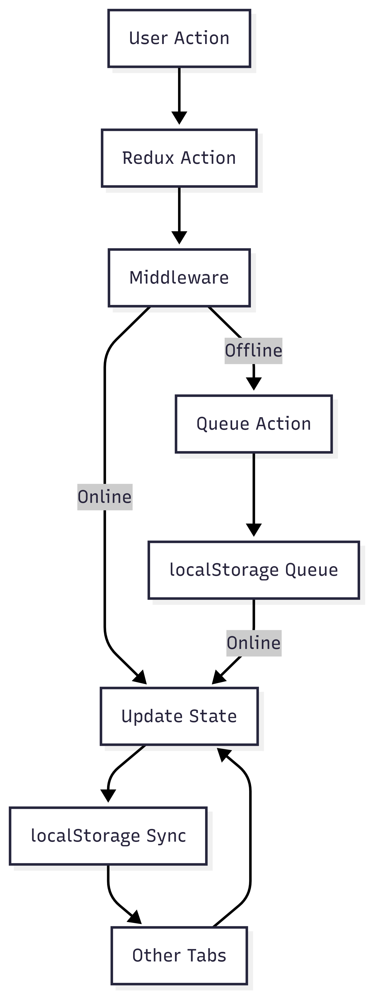

# Getting Started with Create React App

This project was bootstrapped with [Create React App](https://github.com/facebook/create-react-app).

## Available Scripts

In the project directory, you can run:

### `npm start`

Runs the app in the development mode.\
Open [http://localhost:3000](http://localhost:3000) to view it in your browser.

The page will reload when you make changes.\
You may also see any lint errors in the console.

### `npm test`

Launches the test runner in the interactive watch mode.\
See the section about [running tests](https://facebook.github.io/create-react-app/docs/running-tests) for more information.

### `npm run build`

Builds the app for production to the `build` folder.\
It correctly bundles React in production mode and optimizes the build for the best performance.

The build is minified and the filenames include the hashes.\
Your app is ready to be deployed!

See the section about [deployment](https://facebook.github.io/create-react-app/docs/deployment) for more information.

### `npm run eject`

**Note: this is a one-way operation. Once you `eject`, you can't go back!**

If you aren't satisfied with the build tool and configuration choices, you can `eject` at any time. This command will remove the single build dependency from your project.

Instead, it will copy all the configuration files and the transitive dependencies (webpack, Babel, ESLint, etc) right into your project so you have full control over them. All of the commands except `eject` will still work, but they will point to the copied scripts so you can tweak them. At this point you're on your own.

You don't have to ever use `eject`. The curated feature set is suitable for small and middle deployments, and you shouldn't feel obligated to use this feature. However we understand that this tool wouldn't be useful if you couldn't customize it when you are ready for it.

## Learn More

You can learn more in the [Create React App documentation](https://facebook.github.io/create-react-app/docs/getting-started).

To learn React, check out the [React documentation](https://reactjs.org/).

### Code Splitting

This section has moved here: [https://facebook.github.io/create-react-app/docs/code-splitting](https://facebook.github.io/create-react-app/docs/code-splitting)

### Analyzing the Bundle Size

This section has moved here: [https://facebook.github.io/create-react-app/docs/analyzing-the-bundle-size](https://facebook.github.io/create-react-app/docs/analyzing-the-bundle-size)

### Making a Progressive Web App

This section has moved here: [https://facebook.github.io/create-react-app/docs/making-a-progressive-web-app](https://facebook.github.io/create-react-app/docs/making-a-progressive-web-app)

### Advanced Configuration

This section has moved here: [https://facebook.github.io/create-react-app/docs/advanced-configuration](https://facebook.github.io/create-react-app/docs/advanced-configuration)

### Deployment

This section has moved here: [https://facebook.github.io/create-react-app/docs/deployment](https://facebook.github.io/create-react-app/docs/deployment)

### `npm run build` fails to minify

This section has moved here: [https://facebook.github.io/create-react-app/docs/troubleshooting#npm-run-build-fails-to-minify](https://facebook.github.io/create-react-app/docs/troubleshooting#npm-run-build-fails-to-minify)

# Offline Task List App

## Synchronization Strategy

This app uses a custom cross-tab synchronization strategy to keep tasks consistent across multiple browser tabs. Synchronization is achieved using the browser's `localStorage` events. When a task is added, updated, or deleted, the change is written to `localStorage` under a specific key. Other tabs listen for changes to this key and update their local state accordingly. This ensures that all open tabs reflect the latest task data without relying on third-party libraries.

## Offline-First Handling

The app is designed to work seamlessly offline. When the user is offline, any actions (add, update, delete) are queued in `localStorage`. Once the browser detects that it is back online, the queued actions are automatically dispatched and applied to the state. Users are notified when actions are queued and when they are successfully synced.

Conflict resolution is handled using a last-writer-wins strategy based on a `version` field for each task. If a queued action conflicts with a newer version of a task, the latest version is kept.

## Version Conflict Handling

Version conflicts can occur when multiple tabs or sessions attempt to update the same task simultaneously. This app uses a **last-writer-wins** strategy for conflict resolution:

- Each task has a `version` field and an `updatedAt` timestamp.
- When an update is received (from another tab or from the offline queue), the app compares the incoming version to the current version of the task.
- If the incoming version is greater than or equal to the current version, the update is applied. Otherwise, the update is ignored to prevent overwriting newer changes.

**Trade-off:**
- **The last-writer-wins** approach is simple and fast, but does not merge changes. For collaborative scenarios, more advanced conflict resolution (such as operational transforms or CRDTs) could be considered.

- **localStorage for Sync:** Using `localStorage` events is simple and widely supported, but not as fast or reliable as `BroadcastChannel` for high-frequency updates or large data.
- **Last-Writer-Wins:** This strategy is easy to implement but may result in lost updates if multiple users/tabs edit the same task simultaneously. More complex conflict resolution could be added if needed.
- **No Server Sync:** The app is fully client-side and does not sync with a backend. This makes it fast and private, but means data is not shared across devices.

## Folder Structure

- `src/slices/` - Redux slices for state management
- `src/middleware/` - Custom middleware for sync, offline queue, optimistic UI, undo/redo
- `src/selectors/` - Memoized selectors for efficient state queries
- `src/components/` - React components

---
## Architecture Diagram
